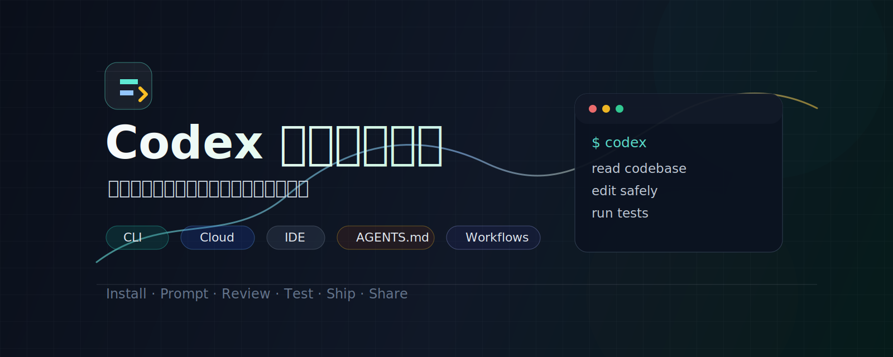

<p align="center">
  
</p>

<h3 align="center">Codex 从入门到精通 · 面向中文开发者的系统化开源教程知识库</h3>

<p align="center">
  <a href="https://codexguide.ai/"></a>
  <a href="https://github.com/freestylefly/CodexGuide/stargazers"></a>
  <a href="https://github.com/freestylefly/CodexGuide/network/members"></a>
  <a href="https://github.com/freestylefly/CodexGuide/issues"></a>
  <a href="./LICENSE"></a>
  <a href="./CONTRIBUTING.md"></a>
</p>

<p align="center">
  <a href="https://codexguide.ai/">在线阅读</a>
  ·
  <a href="./docs/guide/00-overview.md">学习路线</a>
  ·
  <a href="./docs/platform/index.md">入口地图</a>
  ·
  <a href="./docs/configuration/index.md">配置专题</a>
  ·
  <a href="./docs/practice/index.md">实践方法</a>
  ·
  <a href="./docs/recipes/index.md">实战案例</a>
  ·
  <a href="./docs/reference/index.md">官方资料</a>
  ·
  <a href="./docs/community/roadmap.md">共建路线图</a>
</p>

> 从第一次安装，到真实项目交付；把 Codex 用成可靠的工程搭档。  
> 如果这个项目帮你节省了摸索时间，欢迎点亮 Star，让更多中文开发者看到它。

## 项目愿景

Codex 正在从命令行工具演进为一套覆盖 CLI、Web/Cloud、IDE extension 和桌面 App 的编码代理工作流。

CodexGuide 致力于建设一份面向真实工程流程的中文知识库：结构清晰、长期维护、持续共建，并能沉淀为团队可复用的 Codex 实践资产。

- 系统化：从安装、登录、提示词、`AGENTS.md` 到沙盒、审批、团队协作。
- 工程化：围绕修 bug、补测试、代码审查、重构、CI 排障和文档沉淀组织内容。
- 可复现：教程尽量给出命令、输入、预期结果、失败原因和验证方式。
- 官方优先：关键事实链接到 OpenAI 官方资料，并标注最后核对日期。
- 社区共建：欢迎贡献真实案例、排障经验、团队模板和中文最佳实践。

## 快速入口

| 模块 | 你会获得什么 |
| --- | --- |
| [学习路线](./docs/guide/00-overview.md) | 从入门、进阶到团队化的阅读顺序 |
| [入口地图](./docs/platform/index.md) | CLI、Desktop App、Cloud/Web、IDE、ChatGPT 的选择方法 |
| [安装与登录](./docs/guide/01-installation.md) | Codex CLI 安装、更新、登录和第一次进入项目 |
| [第一次改代码](./docs/guide/02-first-run.md) | 选择低风险任务，并完成一次可验证修改 |
| [了解 Codex 项目和聊天](./docs/guide/03-projects-chats.md) | 认识 Project、对话和基础使用方式 |
| [任务顺序执行与并行](./docs/guide/04-task-execution.md) | 理解排队、插入引导和多任务并行 |
| [权限管理](./docs/guide/05-permissions.md) | 了解不同审批与执行模式的边界 |
| [真实工程工作流](./docs/guide/06-workflows.md) | 修 bug、补测试、重构、代码审查和文档生成 |
| [配置与扩展](./docs/configuration/index.md) | CLI 选项、config.toml、MCP、Skills、Subagents、安全审批 |
| [实践方法](./docs/practice/index.md) | 任务设计、非开发工作流和团队实践 |
| [AGENTS.md](./docs/guide/07-agents-md.md) | 给 Codex 编写项目级规则和协作边界 |
| [沙盒与审批](./docs/guide/08-sandbox-approvals.md) | 文件、命令、网络、凭据和生产资源的安全边界 |
| [技能与插件](./docs/guide/09-skills-plugins.md) | 理解 Skills、Plugins 和扩展能力 |
| [自动化](./docs/guide/10-automation.md) | 理解什么时候把重复流程交给后台执行 |
| [Cloud、IDE 与 App](./docs/guide/11-cloud-ide-app.md) | 不同 Codex 使用入口的适用场景 |
| [实战案例库](./docs/recipes/index.md) | 可复制到真实项目的任务模板和复盘结构 |
| [官方资料索引](./docs/reference/index.md) | OpenAI 官方资料、GitHub 仓库和关键链接 |

## 内容框架

```text
CodexGuide
├─ guide       # 从入门到团队化的系统教程
├─ platform    # CLI、App、Cloud、IDE、ChatGPT 入口地图
├─ configuration # CLI 选项、config.toml、MCP、Skills、安全审批
├─ practice    # 任务设计、非开发工作流、团队实践
├─ recipes     # 可复用的真实工程案例
├─ reference   # 官方资料索引与事实来源
└─ community   # 共建路线图与贡献方向
```

当前已搭建：

- Codex CLI 入门路径。
- Codex 多入口使用地图。
- Codex 配置与扩展专题。
- 任务说明与提示词模板。
- 非开发工作流与团队实践方法。
- `AGENTS.md` 项目规则模板。
- 沙盒、审批和安全边界说明。
- Cloud、IDE、App 使用场景对照。
- 修复测试失败、代码审查等案例模板。
- 在线文档站和社区贡献模板。

## 本地预览

```bash
pnpm install
pnpm dev
```

构建静态站点：

```bash
pnpm build
```

## Star 趋势图

[](https://www.star-history.com/#freestylefly/CodexGuide&Date)

## 公众号

微信搜索 **苍何** 或扫描下方二维码关注公众号。后续 Codex 教程、AI 工程化实践和开源项目更新会持续同步。

<p align="center">
  
</p>

## 事实来源

本仓库优先引用官方资料，并会在关键页面标注“最后核对日期”。当前骨架参考：

- [OpenAI Codex 产品页](https://openai.com/codex/)
- [Codex in ChatGPT Help Center](https://help.openai.com/en/articles/11369540-codex-in-chatgpt)
- [OpenAI Codex CLI Getting Started](https://help.openai.com/en/articles/11096431-openai-codex-cli-getting-started)
- [Codex cloud docs](https://platform.openai.com/docs/codex)
- [openai/codex GitHub repository](https://github.com/openai/codex)

## 参与贡献

欢迎提交：

- 新手友好的教程改写。
- 可复现的真实案例。
- 常见错误和解决方案。
- 团队实践、模板和工作流。
- 官方文档变更同步。

请先阅读 [贡献指南](./CONTRIBUTING.md)。如果你还不确定怎么贡献，可以从 [Roadmap](./docs/community/roadmap.md) 或 `good first issue` 开始。

## 开源协议

本项目采用 [MIT License](./LICENSE) 开源。你可以在保留许可声明的前提下自由使用、修改、分发与二次开发。

## 声明

本项目是社区维护的 Codex 中文知识库，并非 OpenAI 官方项目。涉及功能、计划、价格、可用性和安全策略等时间敏感信息时，请以 OpenAI 官方资料为准。
