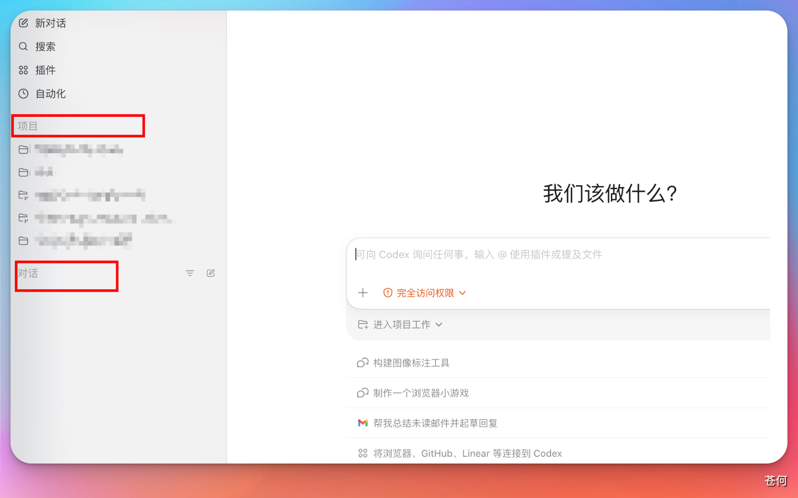
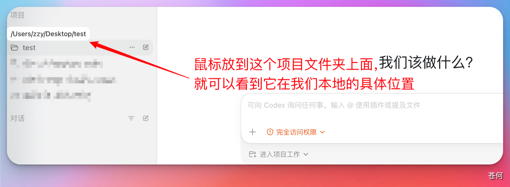
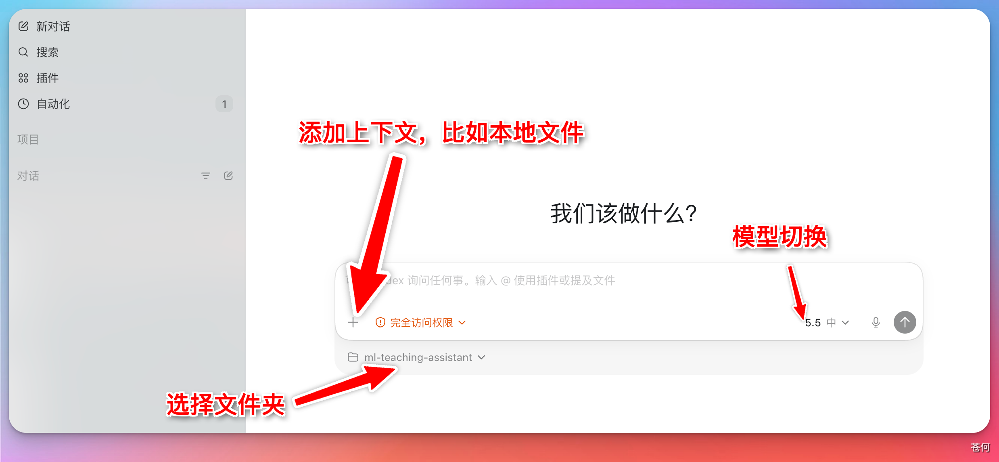
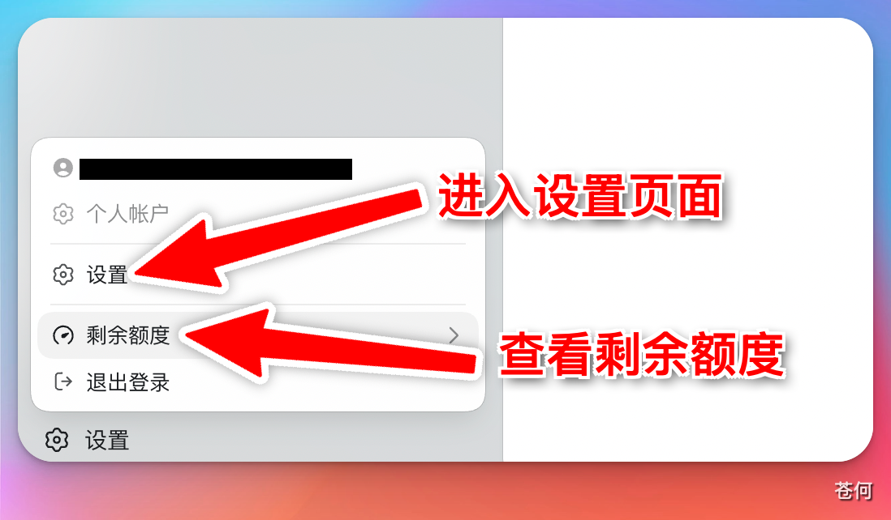
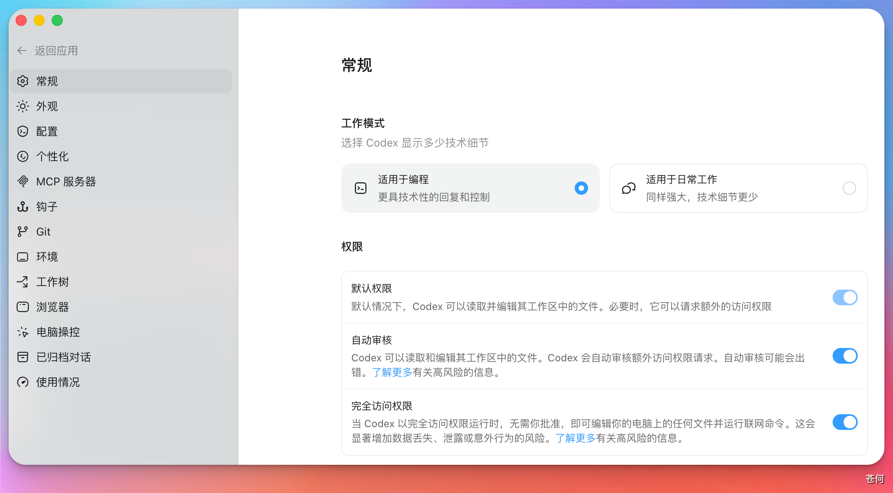

# 了解 Codex 基本组成

::: tip 最后核对
官方资料最后核对日期：2026-05-11。界面说明以当前 Codex App 实际版本为准，不同系统和账号套餐下显示可能略有差异。
:::

## 认识对话和项目

打开 Codex App，左侧栏包含两个主要入口：**Chat（对话）** 和 **Project（项目）**。

**Chat 对话**

与 ChatGPT 网页端对话体验基本一致，适合处理日常的、一次性的问答和简单任务。每个对话相互独立，不共享工作目录。

**Project 项目**

适合需要操作本地文件的任务，例如生成代码、编写文档、制作 PPT、完成报告。在项目里创建的所有对话都共享同一个本地工作目录，方便统一管理多个子任务。

在项目里下达指令后，Codex 的修改会直接应用到你本地文件夹中的文件。

## 对话框功能说明

Codex App 的对话框与 ChatGPT 网页端类似，但额外提供了以下功能：

1. **添加上下文**：可以附加文件、截图或其他参考内容
2. **切换模型**：在不同模型之间切换
3. **控制权限**：设定 Codex 在当前任务中的操作权限
4. **选择工作目录**：指定 Codex 在哪个本地文件夹下执行任务

## 设置面板

点击左下角头像或设置图标可以打开设置面板。

::: tip
设置面板中的大多数选项保持默认即可。有需要时再按需调整，不必一开始就全部设置。
:::

下一步：[用 Codex 完成第一个任务](./04-app-first-task.md)
